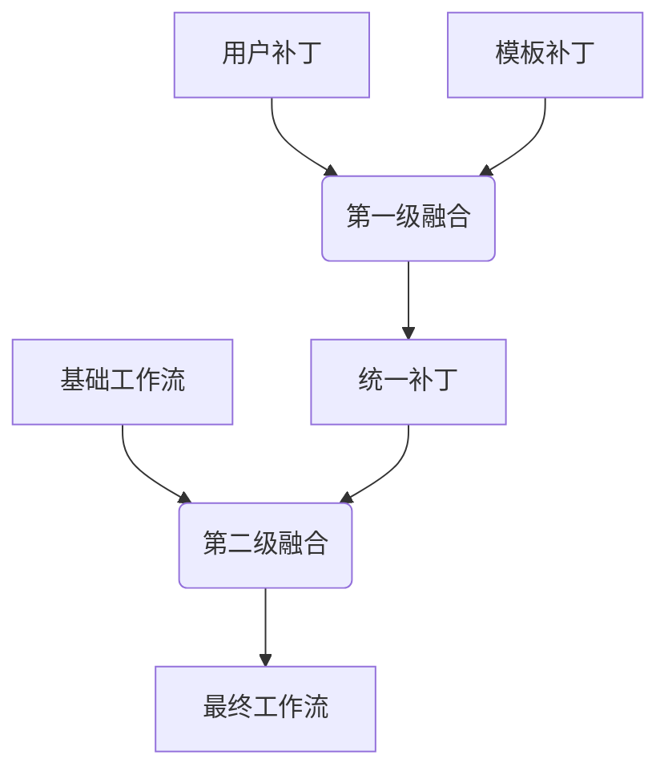

# ComfyFusion Engine - 架构设计文档

## 1. 核心需求

### 1.1 用户现状与痛点

**用户现状**：
- 用户已经拥有 ComfyUI 并创建了一些调试好的工作流
- 这些工作流在 ComfyUI 界面中运行良好，能生成满意的内容
- 用户希望将这些 AI 生成能力集成到自己的应用程序中

**用户痛点**：
- ComfyUI API 过于底层，需要传递完整的复杂节点配置 JSON
- 每次调用都要重复传递大量技术参数和节点关系
- 用户只想修改核心参数（如 prompt、尺寸、风格），但需要修改整个工作流定义
- 缺乏标准化的集成接口，难以在现代应用架构中优雅地调用

**用户诉求**：
- 需要一个"智能代理"服务，隐藏 ComfyUI 的技术复杂性
- 用户只需指定工作流名称和关键参数，代理自动处理技术细节
- 通过标准化协议（MCP）提供与其他 AI 服务一致的调用体验
- 支持工作流的版本管理和预设复用

### 1.2 核心需求
构建一个基于 **FastMCP** 的 **ComfyUI 智能代理服务**，实现以下核心功能：

1. **工作流托管**：用户将调试好的 ComfyUI workflow 和对应模板托管到服务中
2. **自动发现**：服务自动识别新增的工作流，无需重启即可使用
3. **参数简化**：用户只需提供工作流名称和核心参数（prompt、size等）
4. **智能映射**：服务自动将用户参数映射到复杂的工作流节点配置
5. **并发执行**：支持多用户同时调用，智能队列管理执行顺序
6. **结果交付**：直接返回 ComfyUI 原生文件访问 URL，无需重复存储

### 1.3 用户使用流程
```
1. 用户准备文件
   ├── 将基础工作流保存为 {workflow_name}.json
   └── 将对应模板保存为 {workflow_name}_tp.json
   └── 两个文件都放到 workflows/ 目录

2. 系统自动发现
   ├── MCP Server 监控 workflows/ 目录变化
   ├── 自动识别 .json 和 _tp.json 文件对
   └── 动态注册新的工作流能力到 MCP 系统

3. 用户智能调用（三工具协作）
   ├── 步骤1：调用 list_workflows 查看可用工作流
   ├── 步骤2：调用 analyze_and_execute 完成智能生成
   │   ├── 阶段2.1：LLM分析用户需求，生成workflow补丁
   │   └── 阶段2.2：自动调用执行引擎，融合workflow并执行
   └── 获得最终结果：ComfyUI 原生文件访问 URL（格式：http://127.0.0.1:8188/view?filename=xxx）

4. 实际用户体验
   ├── 用户："我要生成一只可爱的猫咪，动漫风格"
   ├── 系统：自动选择合适workflow，构造参数，执行生成
   └── 返回：生成的图片URL，用户可直接访问
```

## 2. 核心设计思路："两级融合"架构

### 2.1 两级融合架构


### 2.2 两级融合原理
1. **第一级融合**：用户补丁与模板补丁深度合并，生成统一补丁。
2. **第二级融合**：将统一补丁应用到基础工作流。此阶段仅对基础工作流中已存在的节点和字段进行替换，不添加任何新节点或新字段，确保工作流结构的稳定性。

代码实现（engine.py）：
```python
# 第一级融合：用户补丁+模板补丁
unified_patch = self.patcher.fuse(user_patch, template_patch)

# 第二级融合：统一补丁+基础工作流 (仅替换现有字段，不添加新节点/字段)
final_workflow = self._apply_unified_patch(base_workflow, unified_patch)
```

## 3. 基于 FastMCP 的技术架构

### 3.1 流式协议架构设计

**MCP Server 流式协议支持**：
- **实时通信**：采用 FastMCP 2.0+ 的流式协议，支持服务端与客户端的实时双向通信
- **流式响应**：所有工具函数支持 `AsyncGenerator` 流式返回，提供实时执行反馈
- **进度跟踪**：通过流式协议实时推送任务执行状态、进度百分比和中间结果
- **错误流式处理**：异常和错误信息通过流式协议实时反馈，便于调试和监控
- **大数据流传输**：支持大型工作流文件和结果数据的流式传输，避免内存溢出

### 3.2 核心工具设计：智能化三工具架构

**设计哲学**：让每个组件都做自己最擅长的事情
- **MCP Server**：专注数据管理和执行引擎，通过流式协议提供实时反馈
- **Client LLM**：发挥语义理解和参数构造优势
- **工具协作**：通过工具链实现智能化自动执行，全程支持流式进度反馈

#### 3.2.1 工具1：`list_workflows` - 工作流枚举器

**职责**：提供可用工作流的清单和基本信息

**输入**：无参数
**输出**：
```json
{
  "workflows": [
    {
      "name": "text2image_v1",
      "description": "文本到图像生成，支持多种风格",
      "category": "image_generation",
      "parameters": ["prompt", "style", "size", "quality"]
    },
    {
      "name": "img2img_v1", 
      "description": "图像到图像转换，支持风格迁移",
      "category": "image_transformation",
      "parameters": ["image_input", "prompt", "strength", "style"]
    }
  ]
}
```

**设计要点**：
- 自动扫描 `workflows/` 目录
- 提取模板文件中的描述信息
- 为用户和LLM提供工作流选择依据

#### 3.2.2 工具2：`analyze_and_execute` - 智能分析器

**职责**：智能分析用户需求，生成工作流补丁，并引导LLM调用执行工具

**核心设计原理**：
- 工具2只负责分析，不执行
- 通过返回引导信息让Client LLM自动调用工具3
- 实现真正的工具链协作

**执行流程**：
```python
async def analyze_and_execute(
    user_request: str,
    workflow_name: str,
    ctx: Context
) -> Dict[str, Any]:
    """
    智能分析用户需求并引导LLM调用执行工具
    
    流程：
    1. 加载指定workflow的模板信息
    2. 构造LLM提示词进行智能分析
    3. 生成完整的workflow补丁
    4. 返回分析结果和工具3的调用引导信息
    5. Client LLM自动理解并调用execute_workflow工具
    """
    
    # 分析用户需求，生成补丁
    workflow_patch = await analyze_user_request(user_request, template_info)
    
    # 返回引导信息，让LLM调用工具3
    return {
        "status": "analysis_complete",
        "workflow_name": workflow_name,
        "user_request": user_request,
        "generated_patch": workflow_patch,
        "next_action": "Please call execute_workflow tool to complete the generation",
        "recommended_call": {
            "tool": "execute_workflow",
            "arguments": {
                "workflow_name": workflow_name,
                "workflow_patch": workflow_patch
            }
        }
    }
```

**LLM引导的工具链协作流程**：
```
用户调用：analyze_and_execute("生成一只可爱的橘猫，动漫风格", "fluximage")
    ↓
工具2执行分析：
1. 加载fluximage模板信息
2. 智能分析用户需求
3. 生成参数补丁：{
     "prompt": "一只可爱的橘猫，毛茸茸的，大眼睛", 
     "style": "anime",
     "quality": "high",
     "size": "1024x1024"
   }
    ↓
工具2返回引导信息：{
    "status": "analysis_complete",
    "generated_patch": {...},
    "next_action": "Please call execute_workflow tool to complete the generation",
    "recommended_call": {
        "tool": "execute_workflow",
        "arguments": {...}
    }
}
    ↓
Client LLM理解引导信息
    ↓
LLM自动调用：execute_workflow(workflow_name="fluximage", workflow_patch={...})
    ↓
工具3执行：两级融合 + ComfyUI调用
    ↓
返回最终结果：生成文件的ComfyUI原生URL
```

#### 3.2.3 工具3：`execute_workflow` - 两级执行引擎

**职责**：接收完整的workflow补丁，执行融合和ComfyUI调用

**输入**：
```json
{
  "workflow_name": "text2image_v1",
  "workflow_patch": {
    "prompt": "一只可爱的橘猫",
    "style": "anime",
    "quality": "high", 
    "size": "1024x1024"
  }
}
```

**处理流程**：
1. **加载基础工作流**：读取 `{workflow_name}.json`
2. **执行两级融合**：
   - 第一级：融合用户补丁与模板补丁
   - 第二级：将统一补丁应用到基础工作流
3. **验证工作流**：检查节点完整性和配置有效性
4. **调用ComfyUI API**：提交最终工作流执行
5. **返回结果**：提供ComfyUI原生文件URL及执行详情

**两级融合示例**：
```python
# 基础工作流 (workflow.json)
base_workflow = {
  "3": {
    "inputs": {
      "seed": 12345,
      "steps": 20,
      "cfg": 8.0,
      "sampler_name": "euler",
      "scheduler": "normal",
      "denoise": 1.0,
      "model": ["4", 0],
      "positive": ["6", 0],
      "negative": ["7", 0],
      "latent_image": ["5", 0]
    }
  }
}

# 模板补丁 (workflow_tp.json)
template_patch = {
  "6": {
    "inputs": {
      "text": "{prompt}"
    }
  },
  "5": {
    "inputs": {
      "width": "{width}",
      "height": "{height}"
    }
  }
}

# 用户补丁 (来自LLM分析)
user_patch = {
  "prompt": "一只可爱的橘猫",
  "width": 1024,
  "height": 1024
}

# 第一级融合：用户补丁+模板补丁
unified_patch = fuse_patches(user_patch, template_patch)

# 第二级融合：统一补丁+基础工作流 (仅替换现有字段，不添加新节点/字段)
final_workflow = apply_patch(base_workflow, unified_patch)
```

### 3.3 工具协作模式：LLM引导的智能工具链

**传统模式**：用户 → 工具 → 结果
**LLM引导的工具链模式**：用户 → 工具2(分析+引导) → LLM理解 → 工具3(执行) → 流式结果反馈

**核心创新设计**：
1. **工具引导LLM**：工具2不直接调用工具3，而是通过返回引导信息让LLM自动调用
2. **智能参数构造**：复杂的语义理解和参数映射由工具2的LLM分析完成
3. **自主工具链**：LLM看到引导信息后自主决定调用工具3，实现真正的智能协作
4. **职责完全分离**：
   - 工具2：只分析，不执行
   - LLM：理解引导信息，自主决策工具调用
   - 工具3：只执行，不分析
5. **流式反馈**：每个工具都支持流式协议，提供实时进度更新

**工具链协作的核心优势**：
- **符合MCP协议设计**：避免工具间直接内部调用的架构问题
- **LLM自主决策**：让LLM根据工具2的引导信息自主选择下一步行动
- **灵活性更强**：LLM可以根据情况选择是否调用工具3，或调用其他工具
- **错误处理更好**：每个工具独立，错误不会级联传播

### 3.4 核心架构设计原则

**基于 FastMCP 2.0+ 的企业级架构**：
- **异步优先**：所有核心功能采用 `async def` 实现，支持高并发
- **流式协议**：MCP Server 采用流式协议进行实时通信，提供流式响应能力
- **流式响应**：使用 `AsyncGenerator[dict, None]` 提供实时执行反馈
- **资源模板**：利用 FastMCP 的资源模板系统实现动态工作流发现
- **服务器组合**：采用模块化设计，支持功能服务器的动态挂载
- **Context 注入**：工具函数接收 Context 参数访问服务器能力
- **LLM协作**：工具主动利用Client LLM能力进行智能推理

### 3.5 核心组件设计

#### 3.5.1 工作流发现引擎

**基于 FastMCP 架构的文件系统监控和动态注册系统**：

```python
class WorkflowDiscoveryEngine:
    """
    企业级工作流发现引擎
    
    基于 FastMCP 架构的文件系统监控和动态注册系统：
    - 异步文件处理
    - 实时能力更新
    - 错误恢复和重试
    - 生命周期管理
    """
    
    def __init__(self, mcp_server: FastMCP, workflows_dir: str = "workflows"):
        self.mcp = mcp_server
        self.workflows_dir = Path(workflows_dir)
        self.observer = Observer()
        self.registered_workflows: Dict[str, Dict] = {}
        self.registered_templates: Dict[str, Dict] = {}
        self.file_handler = WorkflowFileHandler(self)
        self._running = False
```

#### 3.5.2 工作流融合引擎

**支持两级融合的核心引擎**：

```python
class WorkflowFusionEngine:
    """
    企业级工作流融合引擎
    
    基于 FastMCP 架构设计，支持：
    - 异步并发处理
    - 实时进度反馈
    - 错误