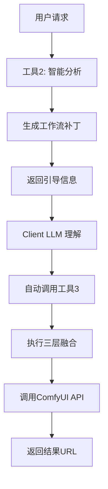

# ComfyFusion Engine - 智能化 ComfyUI 工作流执行引擎

## 🌟 项目概览

ComfyFusion Engine 是一个智能 ComfyUI 工作流执行引擎，旨在解决 ComfyUI 自定义工作流的多样性管理和复杂性问题。它提供标准化的 MCP 接口，能够完美适配并支持各种不同的 ComfyUI 工作流，并通过 MCP 协议与多种编辑器无缝集成，包括：
- ✅ Cursor 编辑器
- ✅ VS Code（通过 MCP 扩展）
- ✅ 任何支持 MCP 协议的 IDE

核心特性包括：
- **三工具协作架构**：通过 `list_workflows` (工作流枚举), `analyze_and_execute` (智能分析), `execute_workflow` (纯执行) 实现智能工作流处理。
- **LLM 引导的工具链协作**：工具之间通过 LLM 引导进行协作，符合 MCP 最佳实践。
- **流式协议支持**：所有工具函数支持异步流式返回，提供实时执行反馈和进度跟踪。
- **三层融合架构**：将用户输入、静态模板和基础工作流进行分层融合，生成最终可执行的工作流。
- **命令行参数覆盖**：支持通过命令行参数灵活配置 ComfyUI 连接、MCP 服务器设置和工作流路径。

## 🌟 核心特性

### 三工具协作架构
- **工具1 (`list_workflows`)**：工作流枚举器，提供可用工作流清单
- **工具2 (`analyze_and_execute`)**：智能分析器，分析用户需求并生成工作流补丁
- **工具3 (`execute_workflow`)**：纯执行引擎，执行三层融合和ComfyUI调用

### LLM引导的工具链协作
- 工具2不直接调用工具3，而是通过返回引导信息让Client LLM自动调用工具3
- 实现真正的MCP协议合规的工具链协作
- 符合FastMCP最佳实践

### 流式协议支持
- 所有工具函数支持 `AsyncGenerator` 流式返回
- 提供实时执行反馈和进度跟踪
- 支持流式错误处理和状态更新

### 三层融合架构
```
用户输入层 (Dynamic Patch)   [最高优先级]
    ⬇️ 覆盖合并
静态配置层 (Template)        [中间优先级] 
    ⬇️ 覆盖合并
基础工作流层 (Workflow)       [基础蓝图]
```

## 🛠️ 技术栈

- **FastMCP** >= 2.0.0 - MCP服务器框架
- **Pydantic** >= 2.0.0 - 数据验证
- **HTTPX** >= 0.24.0 - 异步HTTP客户端
- **aiofiles** >= 23.0.0 - 异步文件操作
- **deepmerge** >= 1.1.0 - 深度合并
- **watchdog** >= 3.0.0 - 文件系统监控

## 📦 安装

### 环境要求
- Python >= 3.9
- ComfyUI 正在运行（默认 http://127.0.0.1:8188）

### 通过 PyPI 安装 (推荐使用 uvx)

首先确保您已安装 `uv`。如果未安装，请运行：
```bash
pip install uv
```

然后，使用 `uv` 安装 `comfyfusion-engine`：
```bash
uv pip install comfyfusion-engine
```

**验证安装：**
安装成功后，您应该可以通过以下命令查看帮助信息：
```bash
comfyfusion-mcp --help
```

## ⚙️ 配置

### 基础配置 (`config/settings.json`)
项目默认配置存储在 `config/settings.json` 中。您可以复制此文件并进行修改，或通过命令行参数覆盖特定设置。

```json
{
  "comfyui": {
    "host": "127.0.0.1",
    "port": 8188,
    "timeout": 300
  },
  "mcp": {
    "server_name": "comfyfusion-engine",
    "description": "ComfyUI 智能工作流执行引擎",
    "version": "1.0.0",
    "protocol": "streaming",
    "enable_streams": true,
    "host": "127.0.0.1",
    "port": 8000
  },
  "paths": {
    "workflows": "./workflows"
  },
  "logging": {
    "level": "INFO"
  }
}
```

### 命令行参数覆盖

启动时可通过命令行参数覆盖配置文件中的任何设置。参数命名遵循 `--<section>-<key>` 格式。

| 参数 | 描述 | 示例 |
| :----------------- | :--------------------------------- | :------------------------------------ |
| `--comfyui-host`   | ComfyUI 服务地址                   | `--comfyui-host 192.168.1.100`        |
| `--comfyui-port`   | ComfyUI 服务端口                   | `--comfyui-port 8188`                 |
| `--mcp-protocol`   | MCP 服务器协议 (`stdio` 或 `streaming`) | `--mcp-protocol streaming`            |
| `--mcp-host`       | MCP 服务器监听地址                 | `--mcp-host 0.0.0.0`                  |
| `--mcp-port`       | MCP 服务器监听端口                 | `--mcp-port 8000`                     |
| `--workflows-path` | 工作流文件目录路径                 | `--workflows-path /custom/workflows`  |

**示例：**
```bash
comfyfusion-mcp \
  --comfyui-host 192.168.1.100 \
  --mcp-port 9000 \
  --workflows-path /custom/workflows
```

## 🔌 MCP 集成

ComfyFusion Engine 可以轻松集成到任何支持 MCP 协议的客户端中，例如 Cursor 或 VS Code。

### 通用 MCP 客户端配置

以下是通用的 MCP 服务器配置模板，您可以根据您的客户端类型进行调整：

**STDIO 协议 (本地直接运行)**：
适用于在本地直接通过命令行启动服务器的场景。

```json
{
  "name": "comfyfusion-engine",
  "description": "ComfyUI 智能工作流执行引擎",
  "protocol": "stdio",
  "command": "comfyfusion-mcp",
  "args": [] // 可选：在此处添加命令行参数，例如 ["--comfyui-host", "192.168.1.100"]
}
```

**Streaming 协议 (网络服务)**：
适用于将 ComfyFusion Engine 作为网络服务运行的场景。

```json
{
  "name": "comfyfusion-engine",
  "description": "ComfyUI 智能工作流执行引擎",
  "protocol": "streaming",
  "host": "127.0.0.1", // 服务器实际监听的 IP 地址
  "port": 8000,       // 服务器实际监听的端口
  "args": [] // 可选：在此处添加命令行参数
}
```

### Cursor 编辑器配置指南

1.  **打开 Cursor 设置**：
    -   使用快捷键 `Ctrl+,` (Windows/Linux) 或 `Cmd+,` (Mac) 打开设置。
    -   在搜索框中输入 "MCP" 或 "Model Context Protocol"。

2.  **编辑 `mcp.servers` 配置**：
    -   找到 `mcp.servers` 配置项，并点击 "Edit in settings.json" 或 "Add Item"。
    -   根据您的需求（STDIO 或 Streaming 协议），添加上述通用配置模板。

    **示例 `settings.json` 片段：**
    ```json
    {
      "mcp.servers": [
        {
          "name": "comfyfusion-engine",
          "description": "ComfyUI 智能工作流执行引擎",
          "protocol": "stdio",
          "command": "comfyfusion-mcp",
          "args": []
        }
        // ... 其他 MCP 服务器配置
      ]
    }
    ```

### VS Code 配置指南

1.  **安装 MCP 扩展**：
    -   在 VS Code 扩展市场搜索并安装支持 MCP 协议的扩展（例如 "MCP Client" 或其他兼容扩展）。

2.  **编辑 `settings.json`**：
    -   打开 VS Code 命令面板 (`Ctrl+Shift+P` 或 `Cmd+Shift+P`)，搜索 "Preferences: Open User Settings (JSON)"。
    -   在 `settings.json` 文件中，找到或添加 `mcp.servers` 配置项，并根据您的需求添加上述通用配置模板。

    **示例 `settings.json` 片段：**
    ```json
    {
      "mcp.servers": [
        {
          "name": "comfyfusion-engine",
          "description": "ComfyUI 智能工作流执行引擎",
          "protocol": "stdio",
          "command": "comfyfusion-mcp",
          "args": []
        }
        // ... 其他 MCP 服务器配置
      ]
    }
    ```

## 🚀 快速开始

### 使用 uvx 启动

```bash
# 使用默认配置启动
comfyfusion-mcp

# 使用命令行参数启动
comfyfusion-mcp \
  --comfyui-host 192.168.1.100 \
  --mcp-port 9000 \
  --workflows-path /custom/workflows
```

### 调用工具示例

一旦 ComfyFusion Engine 作为 MCP 服务器运行并配置到您的编辑器中，您就可以通过 MCP 客户端调用其工具。

**Python 客户端示例 (适用于 Cursor/VS Code 等内置 Python 环境)：**

```python
import mcp

# 连接到 comfyfusion-engine 服务器
# 如果是 STDIO 协议，客户端会自动管理进程
# 如果是 Streaming 协议，请确保服务器已独立运行
client = mcp.Client(server_name="comfyfusion-engine")

# 列出所有可用的工作流
print("正在列出可用工作流...")
workflows_result = await client.call_tool("list_workflows")
print(f"可用工作流: {workflows_result.get('workflows')}")

# 智能分析并执行工作流
# 这是一个流式调用，会实时返回进度和结果
print("\n正在智能分析并执行工作流...")
async for update in client.call_tool_stream("analyze_and_execute", {
    "user_request": "生成一张可爱的橘猫图片，动漫风格，尺寸为 1024x1024",
    "workflow_name": "fluximage" # 假设您有一个名为 'fluximage' 的工作流
}):
    if update.get("status") == "analysis_ready":
        print(f"分析完成，LLM 引导信息: {update.get('guidance')}")
        # 在实际的 LLM 客户端中，LLM 会根据 guidance 自动调用 execute_workflow
    elif update.get("status") == "success":
        print(f"工作流执行成功！输出文件: {update.get('output_files')}")
        print(f"ComfyUI URL: {update.get('comfyui_urls')}")
    elif update.get("status") == "error":
        print(f"执行错误: {update.get('error')}")
    else:
        print(f"进度更新: {update}")

# 直接执行工作流 (如果已知所有参数)
print("\n正在直接执行工作流...")
execute_result = await client.call_tool("execute_workflow", {
    "workflow_name": "fluximage",
    "workflow_patch": {
        "prompt": "a cute orange cat, anime style, high quality",
        "width": 1024,
        "height": 1024,
        "seed": 42 # 示例参数
    }
})
print(f"直接执行结果: {execute_result.get('comfyui_urls')}")
```

## 📁 项目结构
```
mcp-comfyui-anything/
├── src/
│   └── comfyfusion/
│       ├── __init__.py
│       ├── server.py              # FastMCP 服务器主文件
│       ├── fusion/
│       │   ├── __init__.py
│       │   ├── engine.py          # 三层融合引擎
│       │   └── mapping.py         # 参数映射配置
│       ├── api/
│       │   ├── __init__.py
│       │   └── comfyui_client.py  # ComfyUI API 客户端
│       └── utils/
│           ├── __init__.py
│           ├── config.py          # 配置管理
│           ├── logger.py          # 日志系统
│           ├── types.py           # 类型定义
│           └── workflow_discovery.py  # 工作流发现
├── workflows/                     # 工作流和模板存储
│   ├── text2image_v1.json        # 基础工作流
│   ├── text2image_v1_tp.json     # 对应模板
│   └── ...
├── config/
│   └── settings.json             # 配置文件
├── pyproject.toml                # 项目配置
├── run_server.py                 # 启动脚本
└── README.md
```

## 🔧 工作流管理

### 文件命名规范
- 基础工作流：`{工作流名称}.json`
- 模板文件：`{工作流名称}_tp.json`

### 模板设计最佳实践

1. **使用 `_meta` 字段**描述工作流信息
2. **参数化占位符**使用 `{参数名}` 格式
3. **合理分组**相关参数到同一节点
4. **提供默认值**确保基础工作流可独立运行

### 示例模板结构
```json
{
  "_meta": {
    "description": "工作流描述",
    "category": "分类",
    "tags": ["标签1", "标签2"],
    "version": "1.0",
    "author": "作者",
    "created_at": "2024-01-01",
    "updated_at": "2024-01-01"
  },
  "节点ID": {
    "inputs": {
      "参数名": "{占位符}"
    }
  }
}
```

## 🌊 流式特性

### 实时进度反馈
```python
async for update in client.call_tool_stream("execute_workflow", args):
    print(f"进度: {update.get('progress', 0)}%")
    print(f"状态: {update.get('status', 'processing')}")
```

### 错误流式处理
- 异常和错误信息通过流式协议实时反馈
- 支持优雅降级和自动重试
- 详细的错误追踪和调试信息

## 🔄 工具协作流程



## 🛡️ 错误处理

### 监控与日志
- **流式监控**：实时状态和性能指标
- **审计日志**：完整的操作记录
- **错误追踪**：详细的异常信息

### 资源管理
- **并发控制**：合理的任务队列管理
- **资源限制**：CPU、内存和执行时间限制
- **自动清理**：临时文件和缓存管理

## 🔧 开发

### 开发环境设置
```bash
# 安装开发依赖
pip install -e .[dev]

# 代码格式化
black src/
isort src/
 
# 类型检查
mypy src/
```

### 运行测试
```bash
pytest tests/
```

## 🚀 部署

### Docker 部署
```dockerfile
FROM python:3.11-slim

WORKDIR /app
COPY . .
RUN pip install -e .

EXPOSE 8000
CMD ["python", "run_server.py"]
```

### 生产配置
- 使用环境变量覆盖配置
- 配置日志轮转和监控
- 设置健康检查端点

## 📄 许可证

本项目采用 Apache License 2.0 许可。详见 [LICENSE](LICENSE) 文件。