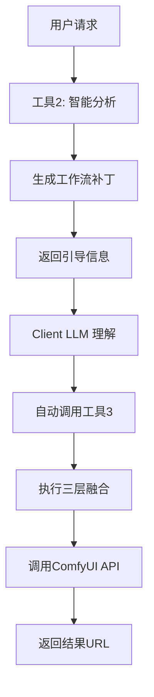

# ComfyFusion Engine - 智能化 ComfyUI 工作流执行引擎

🚀 基于 FastMCP 2.0+ 的 ComfyUI 智能代理服务，采用创新的三工具协作架构和流式协议设计。

## 🌟 核心特性

### 三工具协作架构
- **工具1 (`list_workflows`)**：工作流枚举器，提供可用工作流清单
- **工具2 (`analyze_and_execute`)**：智能分析器，分析用户需求并生成工作流补丁
- **工具3 (`execute_workflow`)**：纯执行引擎，执行三层融合和ComfyUI调用

### LLM引导的工具链协作
- 工具2不直接调用工具3，而是通过返回引导信息让Client LLM自动调用工具3
- 实现真正的MCP协议合规的工具链协作
- 符合FastMCP最佳实践

### 流式协议支持
- 所有工具函数支持 `AsyncGenerator` 流式返回
- 提供实时执行反馈和进度跟踪
- 支持流式错误处理和状态更新

### 三层融合架构
```
用户输入层 (Dynamic Patch)   [最高优先级]
    ⬇️ 覆盖合并
静态配置层 (Template)        [中间优先级] 
    ⬇️ 覆盖合并
基础工作流层 (Workflow)       [基础蓝图]
```

## 🛠️ 技术栈

- **FastMCP** >= 2.0.0 - MCP服务器框架
- **Pydantic** >= 2.0.0 - 数据验证
- **HTTPX** >= 0.24.0 - 异步HTTP客户端
- **aiofiles** >= 23.0.0 - 异步文件操作
- **deepmerge** >= 1.1.0 - 深度合并
- **watchdog** >= 3.0.0 - 文件系统监控

## 📦 安装

### 环境要求
- Python >= 3.9
- ComfyUI 正在运行（默认 http://127.0.0.1:8188）

### 安装步骤

1. **克隆项目**
```bash
git clone <repository-url>
cd mcp-comfyui-anything
```

2. **安装依赖**
```bash
pip install -e .
```

3. **配置设置**
```bash
# 可选：修改配置文件
cp config/settings.json config/settings.local.json
```

## 🚀 快速开始

### 1. 启动服务器
```bash
python run_server.py
```

### 2. 添加工作流

在 `workflows/` 目录中添加工作流文件对：

**基础工作流** (`workflows/my_workflow.json`):
```json
{
  "3": {
    "inputs": {
      "seed": 12345,
      "steps": 20,
      "cfg": 8.0,
      "model": ["4", 0],
      "positive": ["6", 0],
      "negative": ["7", 0],
      "latent_image": ["5", 0]
    },
    "class_type": "KSampler"
  }
  // ... 更多节点
}
```

**模板文件** (`workflows/my_workflow_tp.json`):
```json
{
  "_meta": {
    "description": "我的工作流",
    "category": "image_generation",
    "tags": ["text2image"],
    "version": "1.0"
  },
  "6": {
    "inputs": {
      "text": "{prompt}"
    }
  },
  "5": {
    "inputs": {
      "width": "{width}",
      "height": "{height}"
    }
  }
}
```

### 3. 使用工具

#### 查看可用工作流
```python
result = await client.call_tool("list_workflows")
```

#### 智能分析执行
```python
result = await client.call_tool("analyze_and_execute", {
    "user_request": "生成一只可爱的橘猫，动漫风格",
    "workflow_name": "text2image_v1"
})
```

#### 执行工作流
```python
result = await client.call_tool("execute_workflow", {
    "workflow_name": "text2image_v1", 
    "workflow_patch": {
        "prompt": "a cute orange cat, anime style",
        "width": 1024,
        "height": 1024
    }
})
```

## 📁 项目结构

```
mcp-comfyui-anything/
├── src/
│   └── comfyfusion/
│       ├── __init__.py
│       ├── server.py              # FastMCP 服务器主文件
│       ├── fusion/
│       │   ├── __init__.py
│       │   ├── engine.py          # 三层融合引擎
│       │   └── mapping.py         # 参数映射配置
│       ├── api/
│       │   ├── __init__.py
│       │   └── comfyui_client.py  # ComfyUI API 客户端
│       └── utils/
│           ├── __init__.py
│           ├── config.py          # 配置管理
│           ├── logger.py          # 日志系统
│           ├── types.py           # 类型定义
│           └── workflow_discovery.py  # 工作流发现
├── workflows/                     # 工作流和模板存储
│   ├── text2image_v1.json        # 基础工作流
│   ├── text2image_v1_tp.json     # 对应模板
│   └── ...
├── config/
│   └── settings.json             # 配置文件
├── pyproject.toml                # 项目配置
├── run_server.py                 # 启动脚本
└── README.md
```

## ⚙️ 配置

### 基础配置 (`config/settings.json`)
```json
{
  "comfyui": {
    "host": "127.0.0.1",
    "port": 8188,
    "timeout": 300
  },
  "mcp": {
    "server_name": "comfyfusion-engine",
    "description": "ComfyUI 智能工作流执行引擎",
    "version": "1.0.0",
    "protocol": "streaming",
    "enable_streams": true
  },
  "paths": {
    "workflows": "./workflows"
  },
  "logging": {
    "level": "INFO"
  }
}
```

## 🔧 工作流管理

### 文件命名规范
- 基础工作流：`{工作流名称}.json`
- 模板文件：`{工作流名称}_tp.json`

### 模板设计最佳实践

1. **使用 `_meta` 字段**描述工作流信息
2. **参数化占位符**使用 `{参数名}` 格式
3. **合理分组**相关参数到同一节点
4. **提供默认值**确保基础工作流可独立运行

### 示例模板结构
```json
{
  "_meta": {
    "description": "工作流描述",
    "category": "分类",
    "tags": ["标签1", "标签2"],
    "version": "1.0",
    "author": "作者",
    "created_at": "2024-01-01",
    "updated_at": "2024-01-01"
  },
  "节点ID": {
    "inputs": {
      "参数名": "{占位符}"
    }
  }
}
```

## 🌊 流式特性

### 实时进度反馈
```python
async for update in client.call_tool_stream("execute_workflow", args):
    print(f"进度: {update.get('progress', 0)}%")
    print(f"状态: {update.get('status', 'processing')}")
```

### 错误流式处理
- 异常和错误信息通过流式协议实时反馈
- 支持优雅降级和自动重试
- 详细的错误追踪和调试信息

## 🔄 工具协作流程



## 🛡️ 错误处理

### 监控与日志
- **流式监控**：实时状态和性能指标
- **审计日志**：完整的操作记录
- **错误追踪**：详细的异常信息

### 资源管理
- **并发控制**：合理的任务队列管理
- **资源限制**：CPU、内存和执行时间限制
- **自动清理**：临时文件和缓存管理

## 🔧 开发

### 开发环境设置
```bash
# 安装开发依赖
pip install -e .[dev]

# 代码格式化
black src/
isort src/

# 类型检查
mypy src/
```

### 运行测试
```bash
pytest tests/
```

## 🚀 部署

### Docker 部署
```dockerfile
FROM python:3.11-slim

WORKDIR /app
COPY . .
RUN pip install -e .

EXPOSE 8000
CMD ["python", "run_server.py"]
```

### 生产配置
- 使用环境变量覆盖配置
- 配置日志轮转和监控
- 设置健康检查端点

## 📄 许可证

MIT License - 详见 [LICENSE](LICENSE) 文件

## 🤝 贡献

欢迎提交 Issue 和 Pull Request！

## 📞 支持

如有问题，请提交 Issue 或联系维护团队。

---

**ComfyFusion Engine** - 让 ComfyUI 工作流变得智能而简单 🎨✨ 